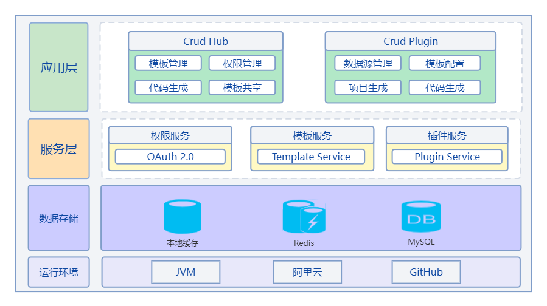

<div align="center"> 

</div>

# crud-hub
 
 [](https://github.com/mars05/crud-hub/actions/workflows/build.yml)
 [](https://plugins.jetbrains.com/plugin/12440)
  
[Crud Hub](https://crud-hub.top/) 是一个**代码生成平台**。可以用来在线管理你的模板代码，并结合IDEA等插件帮助大佬们快速生成增删改查代码。

**相关链接:**

- 官网: [Crud Hub](https://crud-hub.top/)

- 在线文档: [Crud Hub Docs](https://crud-hub.top/docs/)

- 插件: [Crud Intellij Plugin](https://github.com/mars05/crud-intellij-plugin)


## 架构设计



平台采用多端设计

- Web端

  Web端也是管理端，负责模板的设计和管理，当然也支持代码生成。访问地址：[Crud Hub](https://crud-hub.top/)  
- 插件

  插件指Intellij IDEA等开发工具的插件，目前支持IDEA插件，后续可能支持其他工具的插件。插件不能对模板进行设计管理，只能使用模板，进行代码生成或项目生成。


## 平台功能

```
- 登录 / 注册

- 模板市场
  - 公开模板的筛选
  - 模板的复制功能

- 我的模板
  - 项目创建
  - 模板维护
  - 组织管理

- 模板管理
  - 管理所有模板
  - 管理所有组织

- 权限管理
  - 用户管理
  - 角色管理
  - 菜单权限
  - 资源权限

- 个人中心
  - 关于我
  - 账户修改
```
