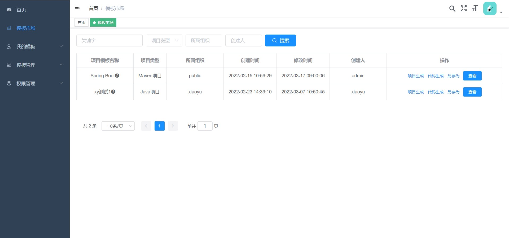

# 介绍

[Crud Hub](https://crud-hub.top/) 是一个**代码生成平台**。可以用来在线管理你的模板代码，并结合IDEA等插件帮助大佬们快速生成增删改查代码。

## 架构设计


平台采用多端设计

- Web端

  Web端也是管理端，负责模板的设计和管理，当然也支持代码生成。访问地址：[Crud Hub](https://crud-hub.top/)  
- 插件

  插件指Intellij IDEA等开发工具的插件，目前支持IDEA插件，后续可能支持其他工具的插件。插件不能对模板进行设计管理，只能使用模板，进行代码生成或项目生成。


## 平台功能

```
- 登录 / 注册

- 模板市场
  - 公开模板的筛选
  - 模板的复制功能

- 我的模板
  - 项目创建
  - 模板维护
  - 组织管理

- 模板管理
  - 管理所有模板
  - 管理所有组织

- 权限管理
  - 用户管理
  - 角色管理
  - 菜单权限
  - 资源权限

- 个人中心
  - 关于我
  - 账户修改
```

### 模板市场

模板市场里是一些公开的模板项目，可以直接使用，也可以对模板市场的模板项目进行复制另存为自己的模板，然后根据需要进行调整。大佬们也可以把自己制作的模板开放出来供他们瞻仰使用，当然也要注意隐私保护哦！！



### 我的模板

我的模板是专门用来管理自己的模板的地方，在这里可以创建新的模板，从模板市场复制的模板也会放在这里。这里还有一个组织列表功能，相当于模板的分组。


### 模板管理

对所有模板进行管理，只对管理员可见。

### 权限管理

用户权限管理，只对管理员可见。

### 个人中心

展示当前登录用户的个人信息和账户信息修改功能。

