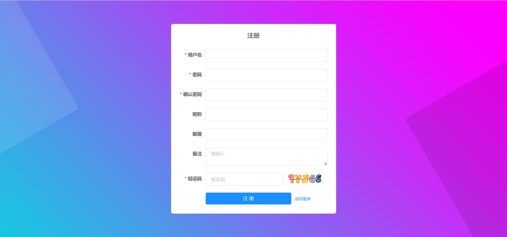
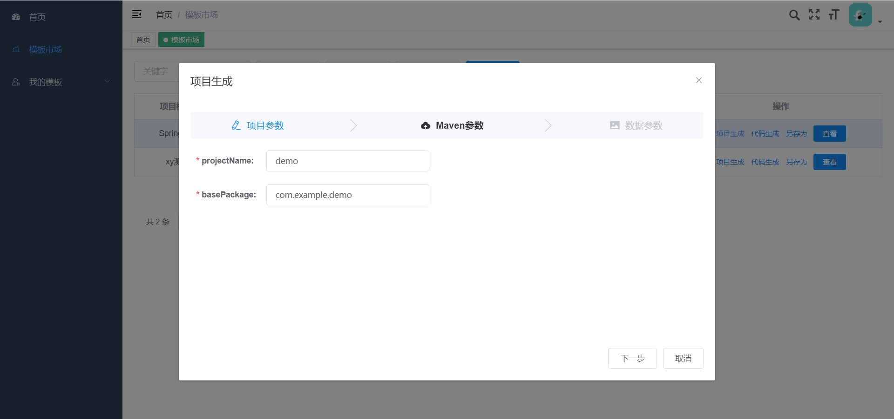
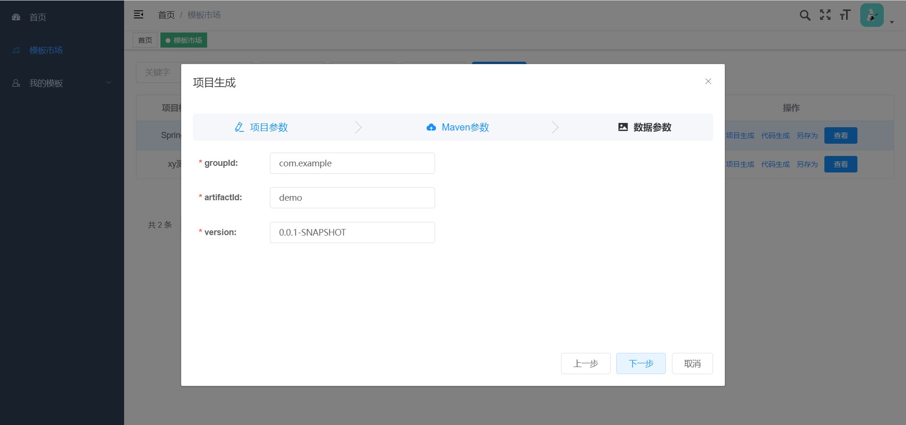
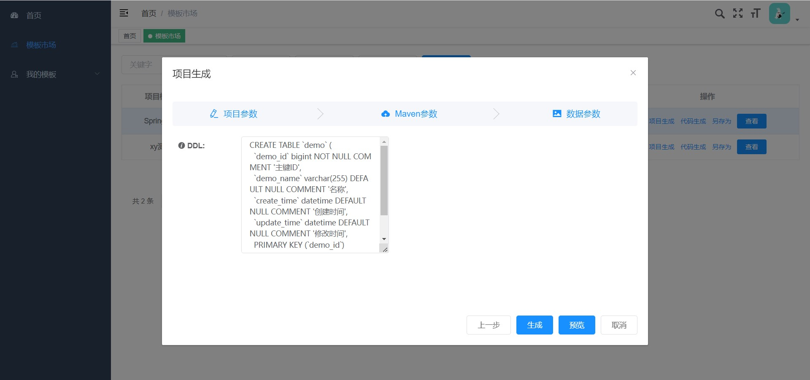
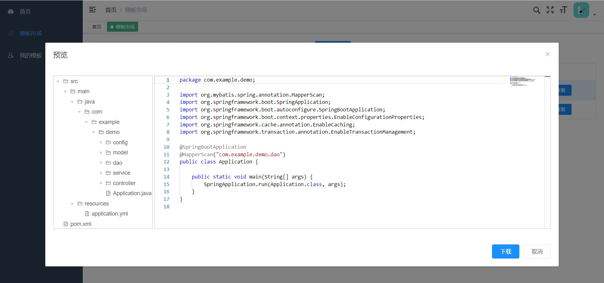
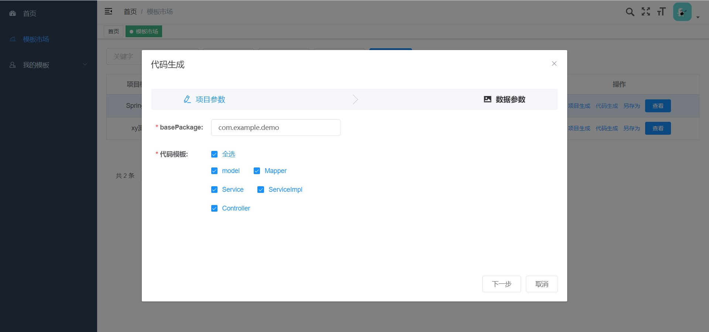
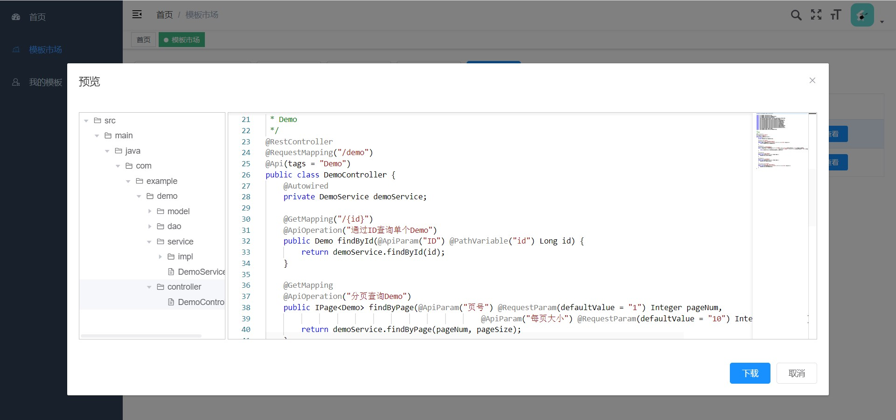

# 快速上手
官网地址：[Crud Hub](https://crud-hub.top/)
## 注册登录
 
进入 [注册](https://crud-hub.top/#/signup) 界面完成用户注册、登录操作。

## 模板使用

进入 **模板市场**、**我的模板** 点击项目生成或代码生成。

### 项目生成

- **步骤1**: 输入项目参数，包括项目名称、basePakcage。

- **步骤2**: 如果模板项目是Maven项目，请完善Maven相关参数。

- **步骤3**: 确认要生成的数据表结构，目前官网只支持DDL的形式。IDEA插件则可以从数据库连接选择表。

- **步骤4**: 点击预览，也可以直接点击生成进行项目zip包下载。

### 代码生成

- **步骤1**: 输入代码生成的参数，包括basePakcage和需要生成的代码模板。

 
- **步骤2**: 确认要生成的数据表结构，目前官网只支持DDL的形式。IDEA插件则可以从数据库连接选择表。

 
- **步骤3**: 点击预览，也可以直接点击生成进行代码zip包下载。

## 模板制作

如果现有的模板不能满足大佬们需求，发现不能愉快的摸鱼，那么可以自己创作模板项目，自己创建的和模板市场是一样的功能。独乐乐不如众乐乐，如果大佬们觉得自己的模板很标准、能够愉快的摸鱼，就把它开放出来，让大家膜拜使用！（**注意:** 公司内部信息、数据库账户密码等敏感信息请谨慎处理）。

制作教程请访问 [模板制作](../template/project.md) 章节。

## 插件使用

虽然官网能进行代码生成，但终归还是要复制来复制去等繁琐操作，不太符合我们摸鱼人的气质，因此，使用插件将更合适。

插件使用请访问 [插件](./) 章节。