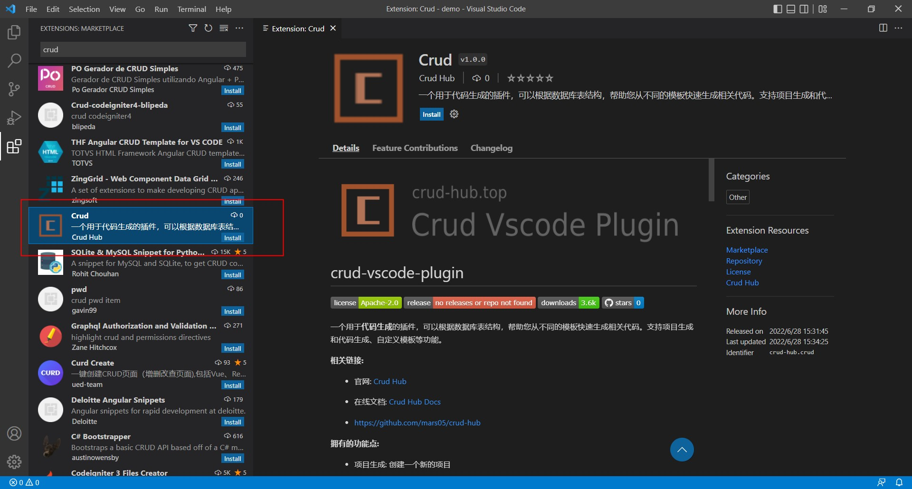
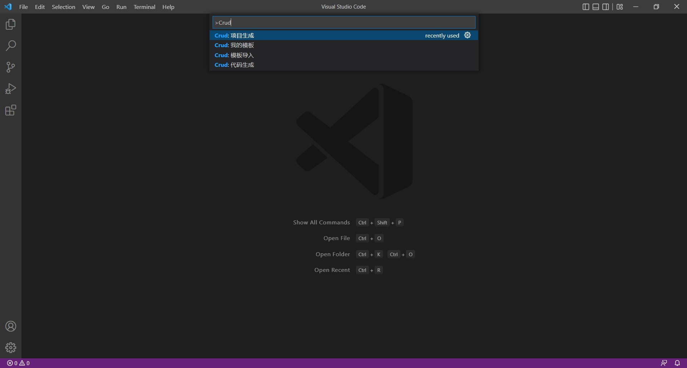
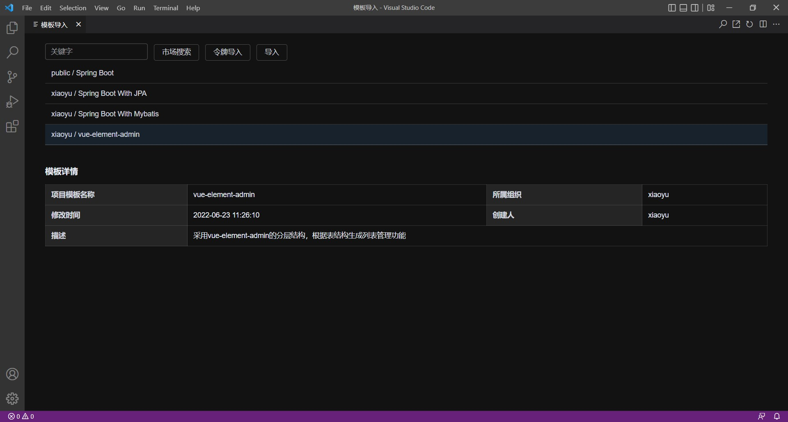
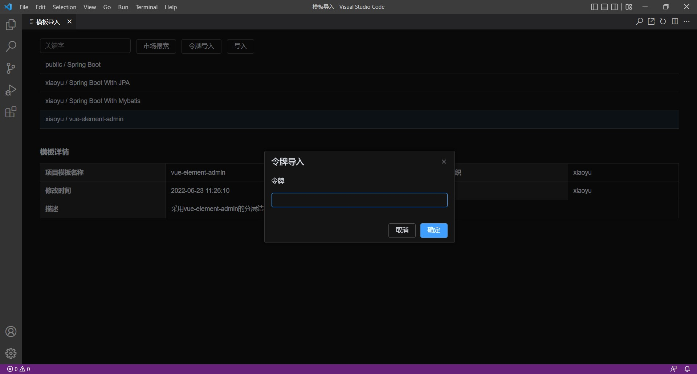
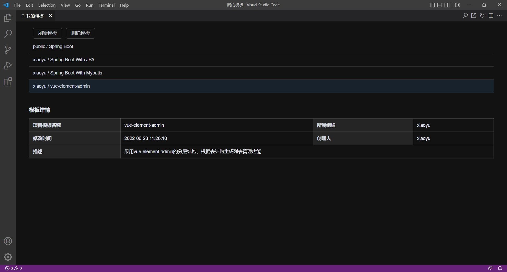
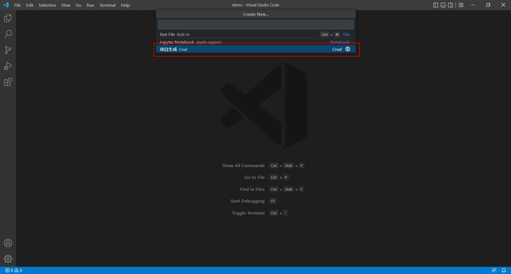
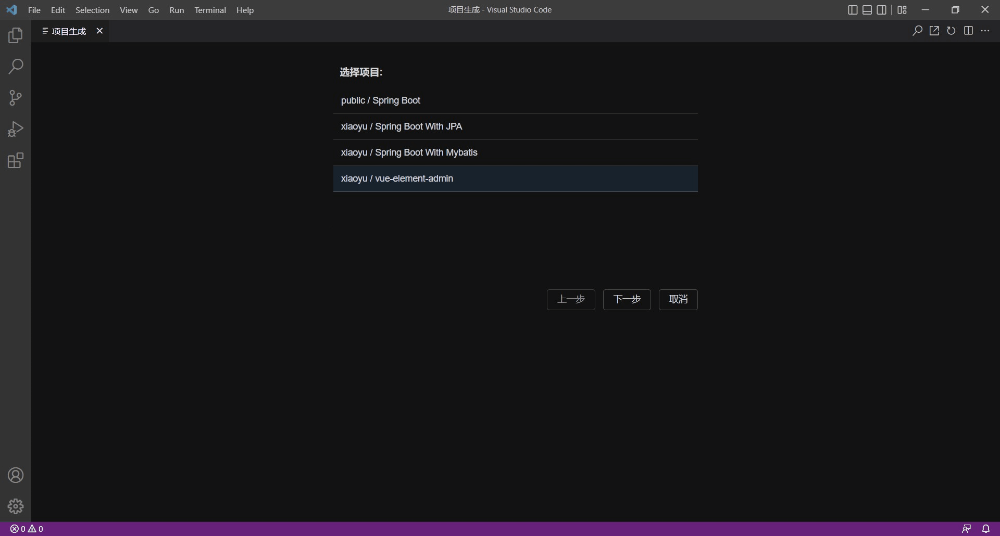
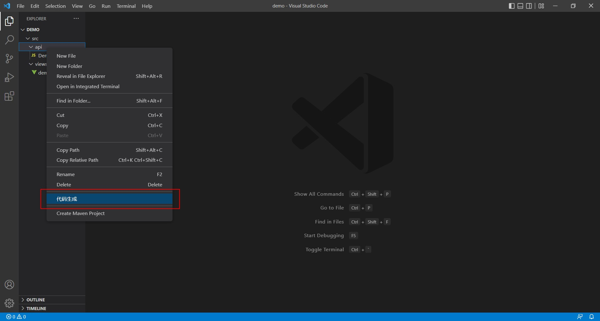
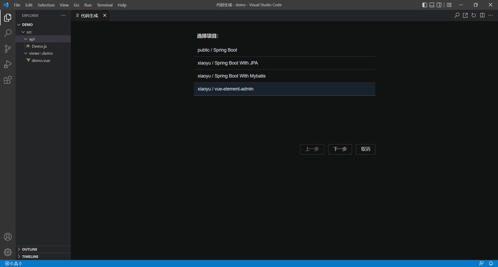

# crud-vscode-plugin

一个用于**代码生成**的Vscode插件，可以根据数据库表结构，帮助您从不同的模板快速生成相关代码。支持项目生成和代码生成、自定义模板等功能。

**相关链接:**

- 官网: [Crud Hub](https://crud-hub.top/)

- 在线文档: [Crud Hub Docs](https://crud-hub.top/docs/)

- https://github.com/mars05/crud-hub

**拥有的功能点:**

- 项目生成: 创建一个新的项目

- 代码生成: 在已有项目中，根据表结构生成代码

- DDL: 支持从**DDL**生成代码

- 模板导入: 按需从模板市场或使用访问令牌导入模板

## 插件安装
- **插件市场:**  搜索 "crud"

## 命令使用

打开命令框，输入"Crud"

 
## 模板导入

- **步骤1:** 打开命令框，输入"Crud"，选择模板导入
 

- **步骤2:** 市场搜索结果中点导入按钮或点击令牌导入，市场搜索的是开放的模板。对于不开放的模板，可以在 **Crud Hub** > [我的模板](https://crud-hub.top/#/mytemplate/template) 设置访问令牌，然后通过访问令牌导入到插件中

- **步骤3:** 我的模板中可以管理已导入的模板。插件导入后的模板是离线模板，不会随 **Crud Hub** 中的模板修改可自动更新，在插件的**我的模板**中，可以点击刷新模板来和**Crud Hub**中的模板进行同步更新

## 项目生成

从菜单栏选择: <kbd>File</kbd> > <kbd>New File</kbd> > <kbd>项目生成</kbd>，或从命令框选择"项目生成"

## 代码生成

选中已有项目，鼠标右键: <kbd>代码生成</kbd>，或从命令框选择"代码生成"

