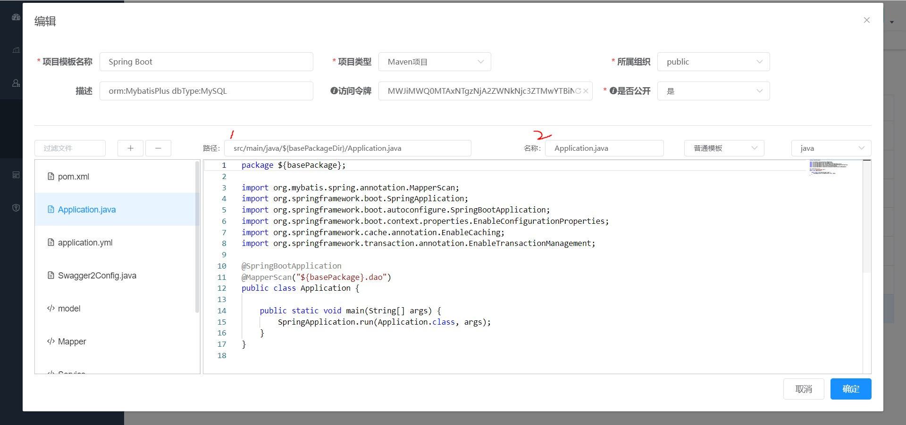

# 文件模板

文件模板分类两种，普通模板和代码模板，采用 **FreeMarker** 模板引擎处理

- **普通模板:** 项目生成时，每个普通模板只会生成一个目标文件，适用于启动类、配置类、配置文件等。

`src/main/java/${basePackageDir}/Application.java`
```java
package ${basePackage};

import org.mybatis.spring.annotation.MapperScan;
import org.springframework.boot.SpringApplication;
import org.springframework.boot.autoconfigure.SpringBootApplication;
import org.springframework.boot.context.properties.EnableConfigurationProperties;
import org.springframework.cache.annotation.EnableCaching;
import org.springframework.transaction.annotation.EnableTransactionManagement;

@SpringBootApplication
@MapperScan("${basePackage}.dao")
public class Application {

    public static void main(String[] args) {
        SpringApplication.run(Application.class, args);
    }
}

```

- **代码模板:** 项目生成时，会根据表结构的多少循环生成目标文件，适用于常规的业务代码，如controller、service、serviceImpl、dao、model等。

`src/main/java/${basePackageDir}/model/${table.upperCamelName}.java`
```java
package ${basePackage}.model;

import lombok.Data;
import com.baomidou.mybatisplus.annotation.TableName;
import com.baomidou.mybatisplus.annotation.TableId;
import com.baomidou.mybatisplus.annotation.TableField;
<#assign columns=table.columns />

<#list columns as column>
<#if !importedDate?? && column.javaTypeClass.simpleName=='Date'>
import java.util.Date;
<#assign importedDate=true />
</#if>
</#list>
/**
* ${table.remarks}
*/
@Data
@TableName("${table.tableName}")
public class ${table.upperCamelName} {
<#list columns as column>
    /**
    * ${column.remarks}
    */
    <#if column.primaryKey>
    @TableId
    </#if>
    @TableField("${column.columnName}")
    private ${column.javaTypeClass.simpleName} ${column.lowerCamelName};
</#list>
}
```

具体模板实例可上 [模板市场](https://crud-hub.top/#/marketplace/index) 查看


---



**提示:** 

1. 路径: 相对于项目的路径，当项目生成的时候，会对路径进行模板化处理，得到最终的文件路径，路径中支持使用模板变量。
2. 名称: 对文件模板起一个别名，不影响生成的目标文件内容。


项目生成或代码生成时，会对文件路径和文件内容进行模板处理，因此模板变量是非常重要的，详情请看 [模板变量](./var.md)