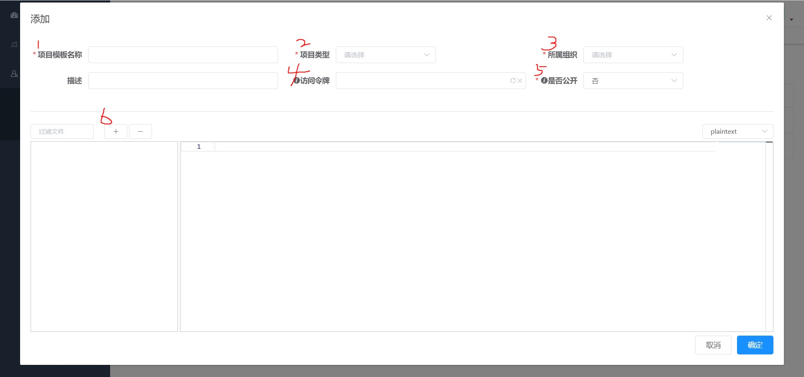

# 项目模板

所有的模板都以项目维度维护，在 **我的模板-模板列表** 点击添加按钮去创建项目。

**说明:** 

- 项目类型: 目前支持Java、Maven，不同类型在 **项目生成** 的时候会要求不同的参数。（此参数会成为模板变量: *projectName*，详情请看 [模板变量](./var.md)）

- 所属组织: 相当于项目分组

- 访问令牌: 对于不公开的项目，插件想要使用项目模板可以通过令牌导入

- 是否公开: 公开的项目在模板市场可见

点击加减按钮，可创建或删除文件模板，详情请点击 [文件模板](./file.md)